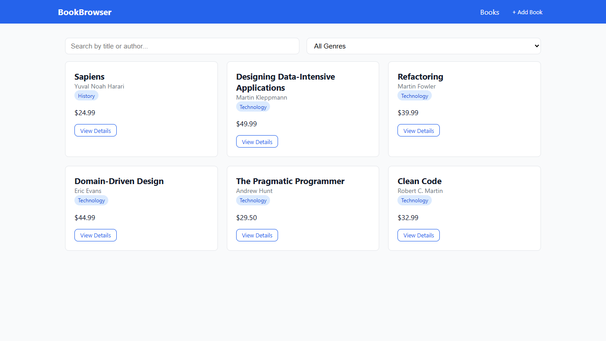
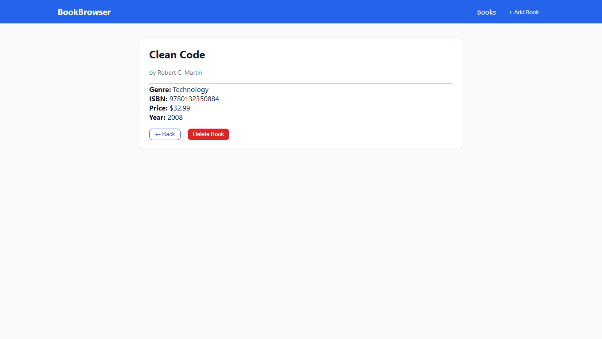
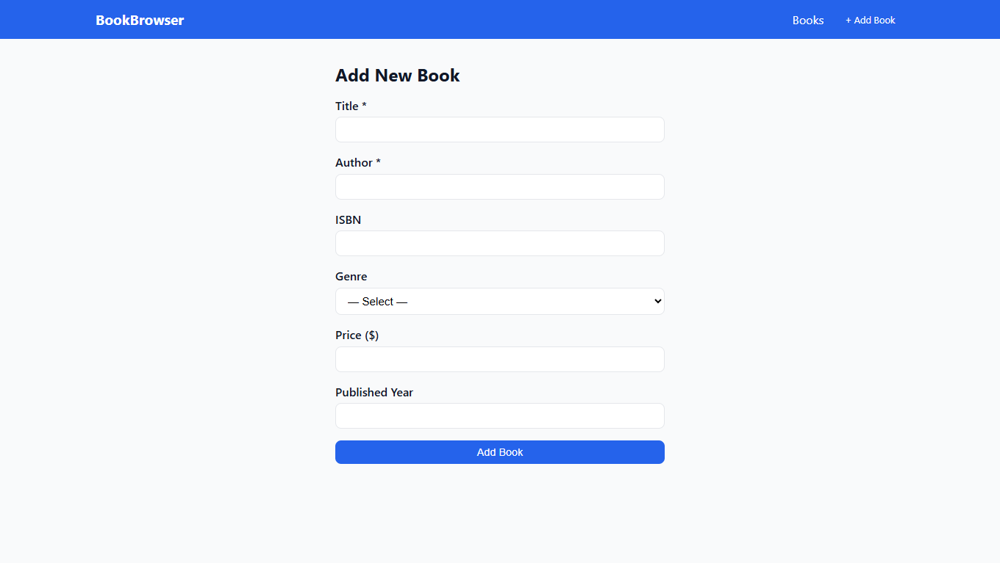

# BookBrowser — Session 1 (Frontend Basics)

Hey 👋 — this is the frontend half of Session 1 of our Software Engineering lab (CSEN 406). It's a tiny React app that talks to the BookStore API we built in the backend session. Nothing fancy — list books, see details, add a new one. The whole point is to get comfortable with the four things every React app boils down to: **components, props, state, and effects** — plus a bit of routing and a clean way to call an API.

If you came here from the slides, this repo is the "after" picture. If you're starting fresh, just clone it, install, run, and read along.

## What you'll build (and why each piece exists)

- **A book list page** — fetches `GET /api/v1/books` on mount and renders cards. This is where `useEffect` finally clicks.
- **A book detail page** — `useParams()` to grab the `:id`, then fetch one book. Shows you why React Router exists.
- **An "Add Book" form** — controlled inputs, `useState` for every field, then `POST` to the backend. The classic form-handling exercise.
- **A Navbar** — shared layout component that lives outside `<Routes>` so it stays put while pages swap.

That's it. No auth, no context, no fancy state library. We're keeping it small on purpose so the React fundamentals don't get drowned by infrastructure.

## Tech I picked (and why)

- **React 18 + Vite** — Vite is just way faster than CRA and the config is one file you can actually read.
- **React Router v6** — current version, declarative `<Routes>`/`<Route>` syntax.
- **Axios** — `fetch` works fine, but axios gives me a baseURL once and I never have to think about it again.

## Running it

You need the backend from `backend-tutorial/session-1-bookstore-basic` running on port **3000** first. Once that's up:

```bash
npm install
npm run dev
```

Then open <http://localhost:5173>. Vite proxies `/api/*` to `http://localhost:3000` (see `vite.config.js`) so we never have to deal with CORS for this tutorial.

## Project layout

```
src/
├── components/   # Navbar, BookCard — small reusable pieces
├── pages/        # BookListPage, BookDetailPage, AddBookPage
├── services/     # axios instance — one source of truth for the baseURL
├── App.jsx       # routing lives here
├── main.jsx      # React entry point
└── index.css     # plain CSS, no Tailwind here
```

The `services/` folder is the thing students usually skip — don't. The moment you have a second component calling the API, you'll thank yourself for having a single axios instance instead of `axios.get('http://localhost:3000/...')` scattered everywhere.

## Stuff worth knowing while you read the code

- **The fetch-on-mount pattern** lives in `BookListPage.jsx` and `BookDetailPage.jsx` — `useEffect(() => { ... }, [])` for the list, `useEffect(() => { ... }, [id])` for the detail page so it refetches when the URL changes.
- **Controlled forms** in `AddBookPage.jsx` — every input has its own `useState` and an `onChange` that updates it. It feels verbose at first; that's the point. Once you've done it the hard way a few times, libraries like react-hook-form make a lot more sense.
- **Why no error boundaries / loading skeletons / toasts?** Because we add those in Session 2. Keep this one focused.

## Common pitfalls

- Forgetting the proxy and getting CORS errors → check `vite.config.js`, the proxy block has to be there.
- Backend isn't running → the list page will sit on "Loading…" forever. Check the network tab.
- Editing form state with `setForm({ title: e.target.value })` and wondering where the other fields went → use the spread: `setForm(prev => ({ ...prev, title: e.target.value }))`.

## What's next

Session 2 layers JWT auth on top of all this — `AuthContext`, `PrivateRoute`, login/register pages, a Bearer token interceptor on axios. Same app, just grown up a bit.

## Screenshots

The book list, fetched from the backend on mount:



A book detail page — `useParams()` + a second fetch keyed on the route id:



The Add Book form — controlled inputs all the way down:



— Built for CSEN 406 at the German International University.
